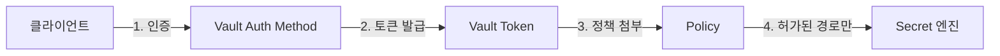
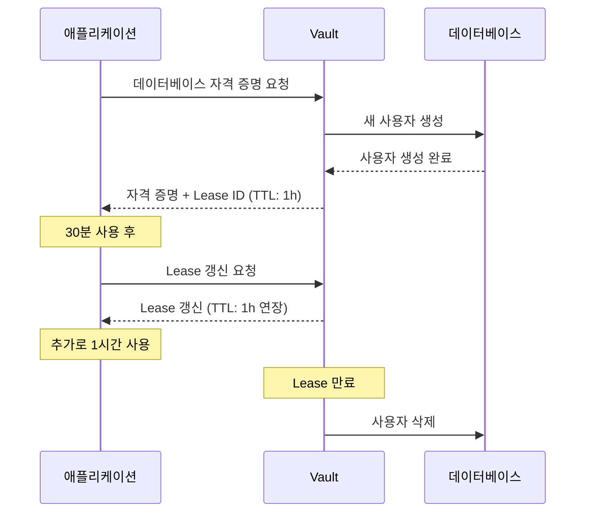
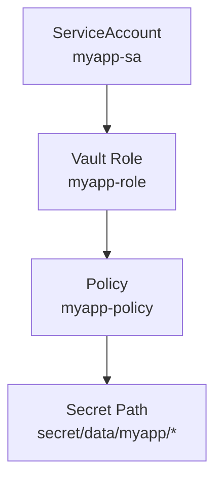

# 사전 지식

Vault를 효과적으로 사용하기 위해 알아야 하는 핵심 개념들을 요약합니다.

## 1. 암호화 및 보안 기본 개념

### 대칭 키 암호화 (Symmetric Encryption)

동일한 키로 암호화와 복호화를 수행합니다.

- **장점**: 빠른 성능
- **단점**: 키 배포 문제
- **예시**: AES-256

### 비대칭 키 암호화 (Asymmetric Encryption)

공개 키와 개인 키 쌍을 사용합니다.

- **공개 키**: 암호화 및 서명 검증에 사용 (공개 가능)
- **개인 키**: 복호화 및 서명 생성에 사용 (비밀 유지)
- **예시**: RSA, ECDSA

### 해시 함수 (Hash Functions)

임의 크기의 데이터를 고정 크기의 해시 값으로 변환합니다.

- **특징**: 단방향 (복호화 불가능)
- **용도**: 비밀번호 저장, 데이터 무결성 검증
- **예시**: SHA-256

### TLS/SSL

네트워크 통신을 암호화하는 프로토콜입니다.

- **인증서**: 서버의 신원을 증명
- **핸드셰이크**: 암호화된 연결 설정
- Vault는 모든 API 통신에 TLS를 사용

## 2. 인증 (Authentication) vs 권한 부여 (Authorization)

### 인증 (Authentication)

**"당신은 누구인가?"** - 신원 확인

- 사용자/서비스가 주장하는 신원이 맞는지 검증
- Vault 인증 방법: Kubernetes, AppRole, JWT, LDAP 등

### 권한 부여 (Authorization)

**"당신은 무엇을 할 수 있는가?"** - 접근 권한 확인

- 인증된 엔티티가 리소스에 대해 어떤 작업을 수행할 수 있는지 결정
- Vault는 Path 기반 정책(Policy)으로 권한 관리

### Vault에서의 핵심 개념



**예시 워크플로우**:

1. Pod가 Kubernetes ServiceAccount로 Vault에 인증
2. Vault가 해당 ServiceAccount용 토큰 발급
3. 토큰에는 정책이 첨부되어 있어 특정 경로만 접근 가능
4. Pod는 허가된 경로에서만 Secret을 읽을 수 있음

## 3. Secret Management 기본 개념

### Secret이란?

민감한 정보로, 외부에 노출되어서는 안 되는 데이터:

- API 키 및 토큰
- 데이터베이스 자격 증명
- 암호화 키
- TLS 인증서
- SSH 키

### Secret 관리의 과제

| 과제 | 설명 |
|------|------|
| **저장** | Secret을 어디에, 어떻게 안전하게 저장할 것인가? |
| **배포** | 애플리케이션에 Secret을 어떻게 전달할 것인가? |
| **순환** | Secret을 얼마나 자주 변경할 것인가? |
| **액세스 제어** | 누가 어떤 Secret에 접근할 수 있는가? |
| **감사** | 누가 언제 어떤 Secret에 접근했는가? |
| **폐기** | 사용이 끝난 Secret을 어떻게 안전하게 폐기할 것인가? |

### Vault가 제공하는 솔루션

- **저장**: 암호화된 스토리지 백엔드
- **배포**: API, CLI, Agent, Operator 등 다양한 방법
- **순환**: 자동 순환 지원 (특히 Dynamic Secrets)
- **액세스 제어**: Path 기반 정책
- **감사**: 모든 작업에 대한 감사 로그
- **폐기**: 리스(Lease) 메커니즘으로 자동 폐기

## 4. Kubernetes 기본 개념

Vault를 Kubernetes에 배포하고 사용하려면 다음 개념을 이해해야 합니다.

### Pod

컨테이너를 실행하는 최소 단위입니다.

- 하나 이상의 컨테이너로 구성
- 동일한 Pod 내 컨테이너는 네트워크와 스토리지를 공유

### Service

Pod에 대한 네트워크 엔드포인트를 제공합니다.

- Pod의 IP는 변경될 수 있지만 Service IP는 고정
- DNS 이름으로 접근 가능 (예: `vault.default.svc.cluster.local`)

### ServiceAccount

Pod의 신원(Identity)을 나타냅니다.

- 각 Pod는 ServiceAccount를 사용하여 Kubernetes API에 인증
- Vault는 ServiceAccount를 사용하여 Pod를 인증할 수 있음

### Namespace

Kubernetes 리소스를 논리적으로 분리합니다.

- 다중 팀이나 프로젝트를 격리
- Vault 정책은 Namespace별로 설정 가능

### ConfigMap vs Secret

| ConfigMap | Secret |
|-----------|--------|
| 비민감한 설정 데이터 | 민감한 데이터 |
| 평문으로 저장 | base64 인코딩 (암호화 아님!) |
| 환경 변수, 볼륨으로 마운트 | 환경 변수, 볼륨으로 마운트 |

> [!WARNING]
> Kubernetes Secret은 base64로 인코딩되어 있을 뿐 암호화되지 않습니다. Vault는 실제 암호화된 저장소를 제공합니다.

### Helm

Kubernetes 패키지 관리자입니다.

- **Chart**: Kubernetes 리소스를 정의하는 패키지
- **Values**: Chart의 설정을 커스터마이즈
- Vault 설치 시 Helm을 사용하면 편리함

## 5. Vault 핵심 용어

### Token

Vault 인증 후 발급되는 자격 증명입니다.

- 모든 Vault API 요청에 토큰 필요
- 토큰에는 정책(Policy)이 첨부되어 권한 정의
- TTL(Time To Live)을 가지며 만료됨

### Policy

Path 기반의 접근 제어 규칙입니다.

```hcl
# database 경로에서 읽기 허용
path "secret/data/database/*" {
  capabilities = ["read"]
}

# api-keys 경로에서 읽기/쓰기 허용
path "secret/data/api-keys/*" {
  capabilities = ["create", "read", "update", "delete"]
}
```

### Lease

동적으로 생성된 Secret의 수명입니다.

- Dynamic Secret은 Lease와 함께 발급됨
- Lease 만료 시 Secret은 자동으로 폐기됨
- Lease는 갱신(Renewal) 가능

### Secret Engine

Secret을 저장하거나 생성하는 컴포넌트입니다.

**주요 Secret 엔진**:

- **KV (Key-Value)**: 정적 Secret 저장
- **Database**: 데이터베이스 동적 자격 증명 생성
- **AWS**: AWS IAM 자격 증명 생성
- **PKI**: X.509 인증서 발급
- **Transit**: 데이터 암호화/복호화 서비스

### Path

Vault의 모든 리소스는 Path로 접근합니다.

```
secret/data/myapp/database
^      ^    ^
|      |    |
엔진   작업  실제 경로
```

- `secret/`: Secret 엔진 이름 (마운트 경로)
- `data/`: KV v2 엔진의 데이터 접근 경로
- `myapp/database`: 사용자 정의 경로

## 6. 리스(Lease) 개념

Vault의 많은 Secret은 **Lease**와 함께 제공됩니다.

### Lease의 주요 특징

1. **TTL (Time To Live)**: Secret의 유효 기간
2. **자동 폐기**: TTL 만료 시 Secret 자동 삭제
3. **갱신 가능**: 사용 중인 Secret의 수명 연장 가능
4. **최대 TTL**: 갱신할 수 있는 최대 수명

### Lease 워크플로우



## 7. RBAC (Role-Based Access Control)

Vault는 RBAC 모델을 사용하여 접근 제어를 수행합니다.

### Vault RBAC 구성 요소

1. **Identity**: 누가 접근하는가? (사용자, 서비스)
2. **Role**: Identity를 그룹화 (예: "frontend-app", "backend-service")
3. **Policy**: Role이 무엇을 할 수 있는가?
4. **Token**: 인증 후 발급되며 Policy를 포함

### 예시: Kubernetes 인증



## 다음 단계

이제 Vault를 사용하는 데 필요한 기본 개념을 이해했습니다. 다음 문서로 진행하세요:

- [Kind 클러스터에서 Vault 배포](./03-kind-deployment.md): 실습 환경 구축 및 Vault 배포

## 참고 자료

- [Vault Concepts](https://developer.hashicorp.com/vault/docs/concepts)
- [Kubernetes Concepts](https://kubernetes.io/docs/concepts/)
- [Vault Policies](https://developer.hashicorp.com/vault/docs/concepts/policies)
