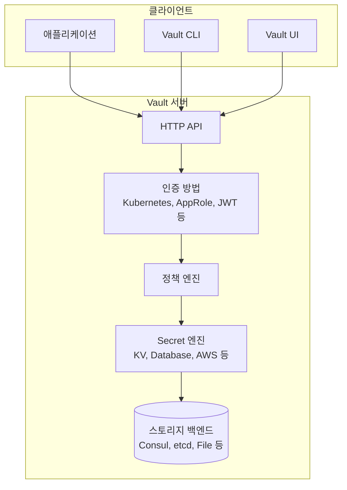

# Vault 개요

## HashiCorp Vault란?

HashiCorp Vault는 **Secret 관리, 암호화 서비스, 권한 있는 액세스 제어를 위한 중앙 집중식 플랫폼**입니다. Vault는 API 키, 비밀번호, 인증서 및 기타 민감한 데이터에 대한 접근을 보호, 저장 및 엄격하게 제어합니다.

## 핵심 기능

### 1. Secret 저장 및 관리

Vault는 다양한 유형의 Secret을 안전하게 저장하고 관리합니다:

- **정적 Secret (Static Secrets)**: API 키, 비밀번호, 인증서 등 수동으로 관리되는 Secret
- **동적 Secret (Dynamic Secrets)**: 요청 시 생성되며 제한된 수명을 가지는 Secret
- **암호화 키**: 데이터 암호화를 위한 키 관리

### 2. 데이터 암호화

Vault는 "Encryption as a Service" 기능을 제공합니다:

- 애플리케이션이 암호화를 직접 구현하지 않고 Vault API를 통해 데이터 암호화/복호화 가능
- 키 순환(rotation) 자동화
- 암호화 키를 애플리케이션 외부에서 중앙 집중식으로 관리

### 3. 아이덴티티 기반 액세스

Vault는 다양한 인증 방법을 지원합니다:

- **Kubernetes**: Pod의 ServiceAccount를 통한 인증
- **LDAP/Active Directory**: 기업 디렉토리 서비스 통합
- **AWS IAM**: AWS 리소스 기반 인증
- **AppRole**: 애플리케이션 및 머신을 위한 인증
- **JWT/OIDC**: 토큰 기반 인증

### 4. 감사 로그 (Audit Logging)

모든 Vault 작업은 감사 로그에 기록됩니다:

- 누가, 언제, 무엇을 요청했는지 추적
- 보안 감사 및 컴플라이언스 요구사항 충족
- 이상 행동 탐지 및 분석

## Vault 아키텍쳐

### 주요 구성 요소

#### 1. HTTP API
- 모든 Vault 작업은 RESTful API를 통해 수행
- CLI, UI, SDK 모두 내부적으로 API 사용

#### 2. 인증 방법 (Auth Methods)
- 클라이언트의 신원을 확인
- 각 인증 방법은 서로 다른 인증 메커니즘 제공

#### 3. 정책 엔진 (Policy Engine)
- Path 기반의 세밀한 액세스 제어
- 최소 권한 원칙(Principle of Least Privilege) 구현

#### 4. Secret 엔진 (Secrets Engines)
- Secret의 저장, 생성, 암호화를 담당
- 각 엔진은 서로 다른 유형의 Secret 처리

#### 5. 스토리지 백엔드 (Storage Backend)
- 암호화된 데이터의 영구 저장
- Vault는 스토리지에 저장하기 전에 모든 데이터를 암호화

## Vault의 보안 모델

### Seal/Unseal 메커니즘

Vault는 시작 시 **Sealed** 상태입니다:

- **Sealed**: 스토리지의 데이터를 복호화할 수 없는 상태
- **Unsealed**: 복호화 키를 메모리에 로드하여 정상 작동하는 상태

Unsealing 과정:

1. Vault 초기화 시 **마스터 키**가 생성됨
2. 마스터 키는 **Shamir's Secret Sharing** 알고리즘으로 여러 조각(shard)으로 분할
3. Vault를 Unseal하려면 정의된 최소 개수(threshold)의 키 조각이 필요
4. 충분한 키 조각이 제공되면 마스터 키가 재구성되고 Vault가 Unsealed 상태로 전환

### Zero Trust 아키텍처

Vault는 Zero Trust 원칙을 따릅니다:

- **신뢰하지만 검증**: 모든 액세스 요청은 인증 및 권한 부여 필요
- **최소 권한**: 클라이언트는 필요한 최소한의 권한만 부여
- **단기 자격 증명**: Dynamic Secrets를 통해 자격 증명의 수명을 제한

## Vault의 주요 Use Cases

### 1. Secret 중앙 집중화

**문제**: Secret이 애플리케이션 코드, 설정 파일, 환경 변수 등에 분산되어 관리가 어려움

**해결**: Vault를 단일 진실 공급원(Single Source of Truth)으로 사용하여 모든 Secret을 중앙에서 관리

### 2. 동적 자격 증명 생성

**문제**: 정적 데이터베이스 자격 증명이 유출되면 전체 시스템이 위험에 노출

**해결**: Vault가 필요 시 동적으로 자격 증명을 생성하고 사용 후 자동으로 폐기

### 3. 데이터 암호화

**문제**: 애플리케이션마다 암호화 로직을 구현하는 것은 복잡하고 오류 발생 가능성이 높음

**해결**: Vault의 Transit Secret Engine을 사용하여 암호화를 서비스로 제공

### 4. PKI 및 인증서 관리

**문제**: SSL/TLS 인증서의 수동 발급 및 갱신은 시간이 많이 소요되고 오류 발생 가능

**해결**: Vault PKI Engine으로 인증서 자동 발급 및 갱신

### 5. Kubernetes Secret 관리

**문제**: Kubernetes Secret은 base64로 인코딩되어 있을 뿐 암호화되지 않음

**해결**: Vault Secrets Operator (VSO)를 사용하여 Vault의 Secret을 Kubernetes에 안전하게 동기화

## Vault vs 다른 솔루션

| 기능 | Vault | Kubernetes Secrets | AWS Secrets Manager |
|------|-------|-------------------|---------------------|
| 동적 Secret 생성 | ✅ | ❌ | 일부 지원 |
| 암호화 서비스 | ✅ | ❌ | ❌ |
| 다양한 인증 방법 | ✅ | 제한적 | AWS IAM만 |
| 멀티 클라우드 지원 | ✅ | ❌ | ❌ |
| 감사 로그 | ✅ | 제한적 | ✅ |
| Secret 버전 관리 | ✅ | ✅ | ✅ |
| PKI/인증서 관리 | ✅ | ❌ | ❌ |

## Vault의 장점

1. **플랫폼 독립적**: 어떤 환경에서든 실행 가능 (클라우드, 온프레미스, Kubernetes)
2. **확장 가능**: 대규모 엔터프라이즈 환경에서도 사용 가능
3. **유연한 인증**: 다양한 인증 방법을 지원하여 기존 시스템과 쉽게 통합
4. **강력한 보안**: 업계 표준 암호화 및 보안 모범 사례 구현
5. **오픈 소스**: 커뮤니티 버전은 무료로 사용 가능

## 다음 단계

Vault의 기본 개념을 이해했다면, 다음 문서로 진행하세요:

- [사전 지식](./02-prerequisites.md): Vault 사용에 필요한 배경 지식
- [Kind 클러스터에서 Vault 배포](./03-kind-deployment.md): 실습 환경 구축

## 참고 자료

- [HashiCorp Vault 공식 문서](https://developer.hashicorp.com/vault/docs)
- [Vault Concepts](https://developer.hashicorp.com/vault/docs/concepts)
- [Vault Architecture](https://developer.hashicorp.com/vault/docs/internals/architecture)
