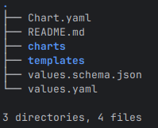

# helm

Helm은 Go 템플릿 언어를 YAML 파일에 사용하여 Kubernetes 리소스 관리를 단순화하는 인기 있는 템플릿 솔루션이자 패키지 관리자처럼 작동.
Helm은 복잡한 프로젝트나 외부 종속성이 있는 경우 Kustomize보다 더 나은 선택이 될 수 있음.

Helm의 핵심 단위는 차트(Chart). 
차트는 버전 관리, 공유 및 배포가 가능한 아티팩트(packaged artifact)이며, 관련된 매니페스트 파일들을 하나의 논리적 배포 단위로 묶임.

https://artifacthub.io/ 는 이미 배포된 다양한 helm 차트가 있음.

e.g., NGINX, Prometheus, Grafana, Jenkins 등.
https://artifacthub.io/packages/helm/jenkinsci/jenkins

---

## [helm 설치](https://helm.sh/docs/intro/install/)

### From script
```bash
curl -fsSL -o get_helm.sh https://raw.githubusercontent.com/helm/helm/main/scripts/get-helm-3
chmod 700 get_helm.sh
./get_helm.sh
```

### From Apt
```bash
curl https://baltocdn.com/helm/signing.asc | gpg --dearmor | sudo tee /usr/share/keyrings/helm.gpg > /dev/null
sudo apt-get install apt-transport-https --yes
echo "deb [arch=$(dpkg --print-architecture) signed-by=/usr/share/keyrings/helm.gpg] https://baltocdn.com/helm/stable/debian/ all main" | sudo tee /etc/apt/sources.list.d/helm-stable-debian.list
sudo apt-get update
sudo apt-get install helm
```

### From Source
```bash
git clone https://github.com/helm/helm.git
cd helm
make
```

## [nginx charts](https://artifacthub.io/packages/helm/bitnami/nginx)

bitnami helm chart 저장소를 추가하고 업데이트
```bash
helm repo add bitnami https://charts.bitnami.com/bitnami
helm repo update
```

nginx 차트 다운로드 및 압축 해제
```bash
helm pull bitnami/nginx --untar
cd nginx
```
Helm 차트 디렉터리 구조



## nginx 배포
name: k3s-nginx

```bash
helm install k3s-nginx bitnami/nginx

kubectl get po | grep nginx
k3s-nginx-54bcc888f4-fnk26   1/1     Running   0          13s
```

운영시 필요한 값 변경이 필요한 경우 별도의 yaml(e.g k3s-nginx.yaml) 파일을 사용하여 배포 가능.
```bash
helm install k3s-nginx bitnami/nginx -f k3s-nginx.yaml
```

k3s-nginx 업데이트
- replicaCount 2 로 변경

```bash
cat k3s-nginx.yaml 
replicaCount: 2

helm upgrade k3s-nginx bitnami/nginx -f k3s-nginx.yaml

kubectl get po | grep nginx
k3s-nginx-54bcc888f4-dq5dx   1/1     Running   0          22s
k3s-nginx-54bcc888f4-fnk26   1/1     Running   0          4m1s

helm list
NAME            NAMESPACE       REVISION        UPDATED                                 STATUS          CHART           APP VERSION
k3s-nginx       default         2               2025-10-20 14:47:00.195082668 +0900 KST deployed        nginx-22.0.11   1.29.2
```

k3s-nginx 삭제
```bash
helm uninstall k3s-nginx
```

## helm 차트 서명 및 검증
helm 차트 무결성을 확인을 하기 위해서는 크게 3 단계 필요
* 차트 패키징 + 서명 (package –sign)
* 차트 검증 (verify)
* 배포 (install/upgrade)

환경별 역할 (admin, dev, Node) 및 가능 작업 정리

| 환경    | 	GPG 개인키 | helm package –sign | helm verify   | helm install/upgrade |
|-------|----------|--------------------|---------------|----------------------|
| admin | 있음       | 가능                 | 가능            | 가능                   |
| dev   | 없음       | 불가 (--sign)        | 실패 (서명 없는 차트) | 가능                   |
| Node  | 없음       | 불가                 | 불가            | 가능                   |

핵심: GPG 인증은 배포 자체를 가능하게 하는 것이 아니라, 검증된 차트를 생성하여 CI/CD에서 신뢰성을 확보하는 목적임.

### 차트 패키징 + 서명 (package –sign)
admin (GPG 개인키 있는 PC) 에서 수행 됨, helm 차트 생성, 서명, 검증, 배포.

**헬를 차트에서 사용될 서명 생성하기**
```bash
brew install gnupg
gpg --full-generate-key

gpg (GnuPG) 2.4.8; Copyright (C) 2025 g10 Code GmbH
This is free software: you are free to change and redistribute it.
There is NO WARRANTY, to the extent permitted by law.

Please select what kind of key you want:
   (1) RSA and RSA
   (2) DSA and Elgamal
   (3) DSA (sign only)
   (4) RSA (sign only)
   (9) ECC (sign and encrypt) *default*
  (10) ECC (sign only)
  (14) Existing key from card
Your selection? 1
RSA keys may be between 1024 and 4096 bits long.
What keysize do you want? (3072) 2048
Requested keysize is 2048 bits
Please specify how long the key should be valid.
         0 = key does not expire
      <n>  = key expires in n days
      <n>w = key expires in n weeks
      <n>m = key expires in n months
      <n>y = key expires in n years
Key is valid for? (0) 0
Key does not expire at all
Is this correct? (y/N) y

GnuPG needs to construct a user ID to identify your key.

Real name: [Name]
Email address: [E-Mail]
Comment: [Comment]

<snip>

```

**헬를 차트에 차트 패키징**
```bash

helm repo add bitnami https://charts.bitnami.com/bitnami
helm repo update
helm pull bitnami/nginx --untar
cd nginx

cd ..
helm package nginx --sign --key "Ricky <ricky@example.com>"
```

**공개키 export (dev / CI 환경용)**
```bash
gpg --export -a "Ricky <ricky@example.com>" > publickey.asc
```

### 차트 검증 (verify)
```bash
helm verify nginx-<ver>.tgz
```

dev 에서는 charts 검증을 위해선 admin 에서 export 한 공개키가 필요함
```bash
gpg --import publickey.asc
helm verify nginx-<ver>.tgz
```

### 배포 (install/upgrade)
```bash
helm install k3s-nginx ./nginx-<ver>.tgz -f k3s-nginx.yaml

helm upgrade k3s-nginx ./nginx-<ver>.tgz -f k3s-nginx.yaml
```


## CI/CD 배포 흐름 예시

[ admin ]
helm pull → helm package --sign → helm verify → helm install/upgrade
│
└─ 공개키 export → [ dev / CI 환경 ]

[ dev / CI ]
gpg --import publickey.asc → helm verify → helm install/upgrade

[ Node (k3s cluster) ]
Helm client(admin / dev)에서 배포 → Pod/Service 실행

** lint → sign → verify → deploy 순서로 CI/CD를 구성하면, 어느 단계에서든 실패 시 배포 차단 가능하여 안전한 배포 가능 **


## Helm + ConfigMap 기반 Rolling Update 가이드

- bitnami/nginx 의 charts 는 수정하지 않음.

Helm 차트에서 ConfigMap을 사용하여 애플리케이션 설정을 관리하는 경우, 설정 변경 시 롤링 업데이트를 트리거하기 위한 추가 구성이 필요함.

* ConfigMap에 정의 및 해시 주석 추가: 
ConfigMap에 설정 변경을 감지할 수 있는 해시 주석을 추가.
  deploymentAnnotations

```bash
k apply -f k3s-nginx-config.yaml
configmap/k3s-nginx-config created

k get po
NAME                         READY   STATUS    RESTARTS   AGE
k3s-nginx-54bcc888f4-hbmvd   1/1     Running   0          84s
k3s-nginx-54bcc888f4-tsb2d   1/1     Running   0          84s

kubectl get configmap k3s-nginx-config -o json | sha256sum | awk '{print $1}'
17d2b70addfe349ae609bd7680562fc253c46696f31f31897c96bd02d9e90c2b

helm upgrade --install k3s-nginx bitnami/nginx \
  -f k3s-nginx.yaml \
  --set deploymentAnnotations.configmap-reload=17d2b70addfe349ae609bd7680562fc253c46696f31f31897c96bd02d9e90c2b
```

### [배포](../../helmcharts/deploy-nginx.sh) 스크립트
```bash
CONFIG_HASH=$(kubectl get configmap k3s-nginx-config -o json | sha256sum | awk '{print $1}')
echo "Configuration hash: $CONFIG_HASH"
# CONFIG_HASH 는 추후 ArgoCD hook 에서 처리 예정.

helm upgrade --install k3s-nginx bitnami/nginx \
  -f k3s-nginx.yaml \
  --set deploymentAnnotations.configmap-reload=$CONFIG_HASH
```

---

## Reference Links
- [Bitnami Secure Images](https://techdocs.broadcom.com/us/en/vmware-tanzu/bitnami-secure-images/bitnami-secure-images/services/bsi-doc/index.html)
- [Bitnami Secure Images Docker hub](https://hub.docker.com/u/bitnamisecure)
- [Bitnami GitHub Helm Charts]( https://github.com/bitnami/charts)
- [헬름 출처 및 무결성](https://helm.sh/ko/docs/topics/provenance/)
