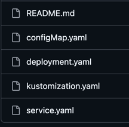

# [Kustomize](https://kustomize.io/)

Kustomize는 템플릿 없이도 kubernetes 리소스를 관리, customize, 적용할 수 있도록 kubectl 에 통합된 CLI 도구.
따라서 kustomize 를 사용하려면 표준 쿠버네티스 리소스 파일을 담은 기본 디렉터리를 만들고 
리소스, customize 세부사항을 담는 kustomization.yaml 파일이 있어야함.

| 구성 요소 | 설명 |
|-----|--------|
| 리소스 (Resources) | 표준 Kubernetes YAML 파일들 (Deployment, Service 등). 플레이스홀더를 사용하지 않습니다. |
| kustomization.yaml | 애플리케이션에 포함될 리소스 목록과 적용할 사용자 정의 사항(예: 이미지 태그, 레이블, 패치)을 정의합니다. |
| 루트 (Root) | kustomization.yaml 파일이 포함된 디렉토리입니다. 리소스 파일은 이 루트의 하위 또는 내부에 있어야 합니다. |

https://kubernetes.io/ko/docs/tasks/manage-kubernetes-objects/kustomization/


## [Install](https://kubectl.docs.kubernetes.io/installation/kustomize/homebrew/)

```bash
brew install kustomize
```

## helloWorld Example 배포하기
https://github.com/kubernetes-sigs/kustomize/tree/master/examples/helloWorld

```bash
git clone git@github.com:youngseokyoon/kustomize.git
ls kustomize/examples/helloWorld/ 
configMap.yaml deployment.yaml kustomization.yaml README.md service.yaml
```




| 파일 이름              | 설명                                      |
|--------------------|-----------------------------------------|
| deployment.yaml    | 기본 리소스                                  |
| kustomization.yaml | (사용자 정의 정의 파일로 프로젝트에 포함된 리소스 목록을 정의합니다. |
| service.yaml | 기본적으로 같이 배포 되어야하는 서비스 목록을 정의합니다. |


```bash
helloWorld % kustomize build . | k apply -f -
configmap/the-map created
service/the-service created
deployment.apps/the-deployment created
```

```bash
helloWorld % k get svc 
NAME          TYPE           CLUSTER-IP     EXTERNAL-IP   PORT(S)          AGE
kubernetes    ClusterIP      10.96.0.1      <none>        443/TCP          6d3h
the-service   LoadBalancer   10.96.17.236   <pending>     8666:31948/TCP   89s

helloWorld % k get po  
NAME                             READY   STATUS    RESTARTS   AGE
the-deployment-7f6d4b4c7-9r7lz   1/1     Running   0          94s
the-deployment-7f6d4b4c7-pc9nw   1/1     Running   0          94s
the-deployment-7f6d4b4c7-t8mzr   1/1     Running   0          94s

helloWorld % k get deploy          
NAME             READY   UP-TO-DATE   AVAILABLE   AGE
the-deployment   3/3     3            3           98s
```

```bash
# 삭제하기
kubectl delete -k ./
```

## helloWorld Example 업데이트

replicas: 3 -> 1 로 변경 예정.

초기 replicas는 3으로 설정되어 있음.
```bash
cat deployment.yaml| grep replicas
  replicas: 3

k get deploy
NAME             READY   UP-TO-DATE   AVAILABLE   AGE
the-deployment   3/3     3            3           17m

k describe deploy the-deployment | grep Replicas
Replicas:               3 desired | 3 updated | 3 total | 3 available | 0 unavailable
  Available      True    MinimumReplicasAvailable
```

deployment.yaml replicas 1 로 수정 후 배포.
```bash
cat deployment.yaml| grep replicas
  replicas: 1

kustomize build . | k apply -f -
configmap/the-map unchanged
service/the-service unchanged
deployment.apps/the-deployment configured
```

```bash
k get deploy
NAME             READY   UP-TO-DATE   AVAILABLE   AGE
the-deployment   1/1     1            1           21m
```
