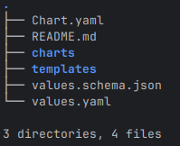

# helm

Helm은 Go 템플릿 언어를 YAML 파일에 사용하여 Kubernetes 리소스 관리를 단순화하는 인기 있는 템플릿 솔루션이자 패키지 관리자처럼 작동.
Helm은 복잡한 프로젝트나 외부 종속성이 있는 경우 Kustomize보다 더 나은 선택이 될 수 있음.

Helm의 핵심 단위는 차트(Chart). 
차트는 버전 관리, 공유 및 배포가 가능한 아티팩트(packaged artifact)이며, 관련된 매니페스트 파일들을 하나의 논리적 배포 단위로 묶임.

https://artifacthub.io/ 는 이미 배포된 다양한 helm 차트가 있음.

e.g., NGINX, Prometheus, Grafana, Jenkins 등.
https://artifacthub.io/packages/helm/jenkinsci/jenkins

---

## [helm 설치](https://helm.sh/docs/intro/install/)

### From script
```bash
curl -fsSL -o get_helm.sh https://raw.githubusercontent.com/helm/helm/main/scripts/get-helm-3
chmod 700 get_helm.sh
./get_helm.sh
```

### From Apt
```bash
curl https://baltocdn.com/helm/signing.asc | gpg --dearmor | sudo tee /usr/share/keyrings/helm.gpg > /dev/null
sudo apt-get install apt-transport-https --yes
echo "deb [arch=$(dpkg --print-architecture) signed-by=/usr/share/keyrings/helm.gpg] https://baltocdn.com/helm/stable/debian/ all main" | sudo tee /etc/apt/sources.list.d/helm-stable-debian.list
sudo apt-get update
sudo apt-get install helm
```

### From Source
```bash
git clone https://github.com/helm/helm.git
cd helm
make
```

## [nginx charts](https://artifacthub.io/packages/helm/bitnami/nginx)

bitnami helm chart 저장소를 추가하고 업데이트
```bash
helm repo add bitnami https://charts.bitnami.com/bitnami
helm repo update
```

nginx 차트 다운로드 및 압축 해제
```bash
helm pull bitnami/nginx --untar
cd nginx
```
Helm 차트 디렉터리 구조



## nginx 배포
name: k3s-nginx

```bash
helm install k3s-nginx bitnami/nginx

kubectl get po | grep nginx
k3s-nginx-54bcc888f4-fnk26   1/1     Running   0          13s
```

운영시 필요한 값 변경이 필요한 경우 별도의 yaml(e.g k3s-nginx.yaml) 파일을 사용하여 배포 가능.
```bash
helm install k3s-nginx bitnami/nginx -f k3s-nginx.yaml
```

k3s-nginx 업데이트
- replicaCount 2 로 변경

```bash
cat k3s-nginx.yaml 
replicaCount: 2

helm upgrade k3s-nginx bitnami/nginx -f k3s-nginx.yaml

kubectl get po | grep nginx
k3s-nginx-54bcc888f4-dq5dx   1/1     Running   0          22s
k3s-nginx-54bcc888f4-fnk26   1/1     Running   0          4m1s

helm list
NAME            NAMESPACE       REVISION        UPDATED                                 STATUS          CHART           APP VERSION
k3s-nginx       default         2               2025-10-20 14:47:00.195082668 +0900 KST deployed        nginx-22.0.11   1.29.2
```

k3s-nginx 삭제
```bash
helm uninstall k3s-nginx
```

---

## Reference Links
- [Bitnami Secure Images](https://techdocs.broadcom.com/us/en/vmware-tanzu/bitnami-secure-images/bitnami-secure-images/services/bsi-doc/index.html)
- [Bitnami Secure Images Docker hub](https://hub.docker.com/u/bitnamisecure)
- [Bitnami GitHub Helm Charts]( https://github.com/bitnami/charts)
